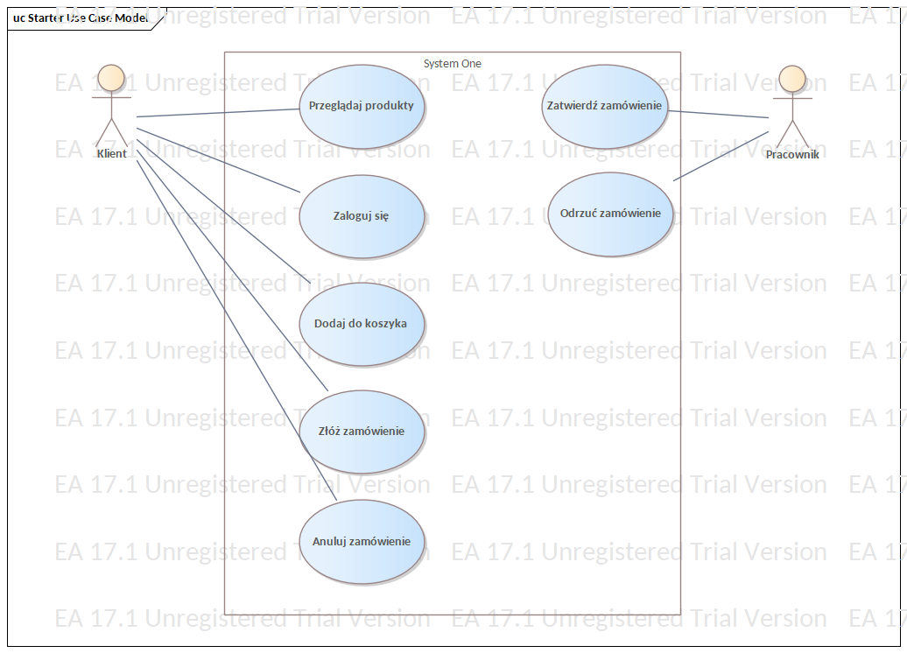
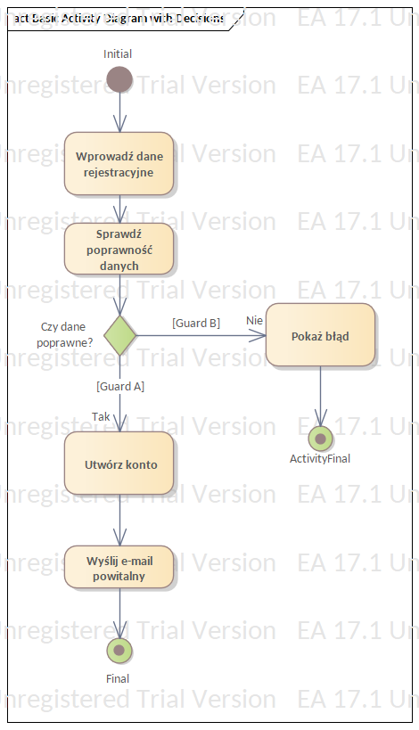
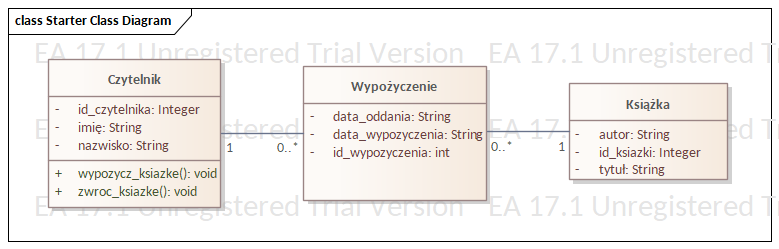
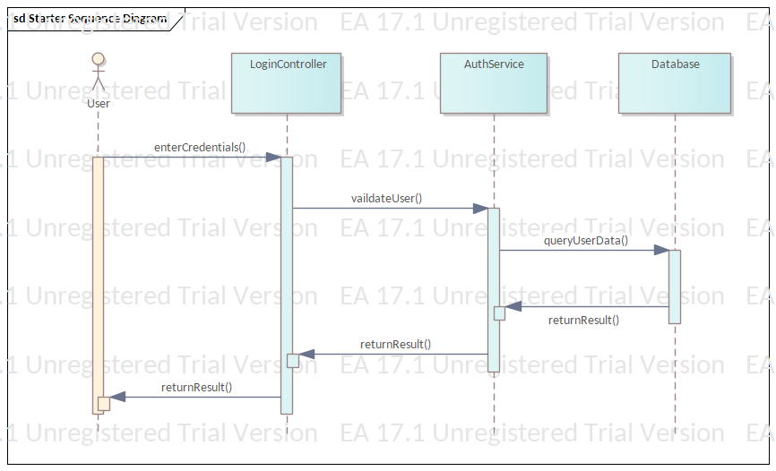
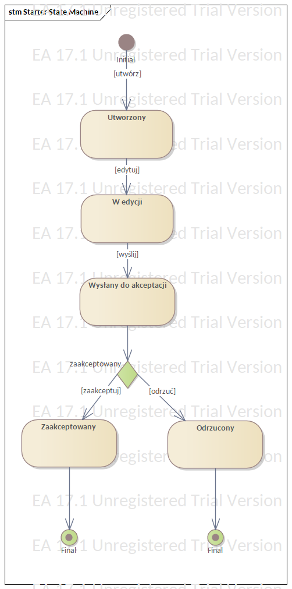
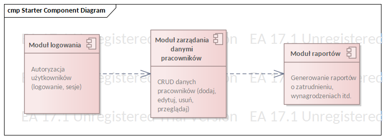
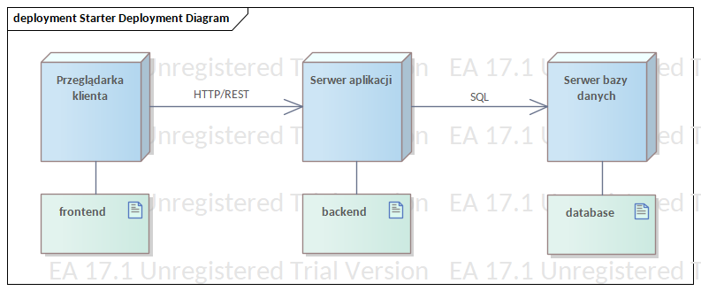
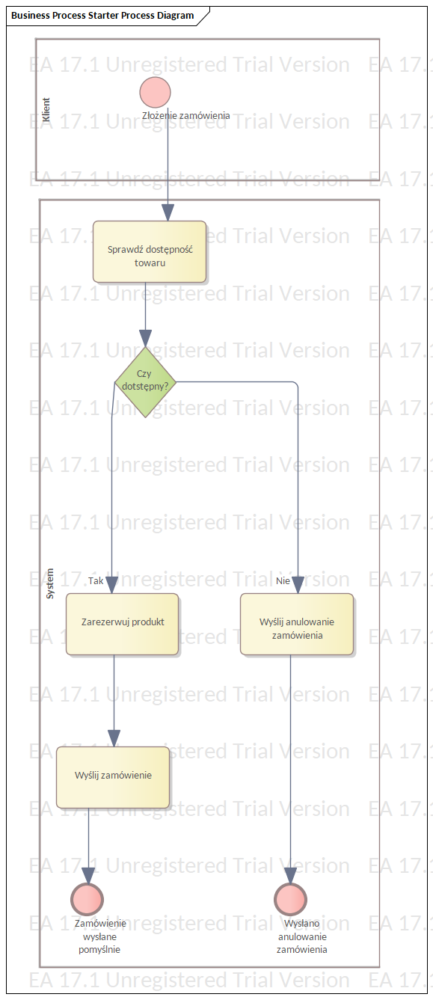

# 📘 UML Diagrams – Sample Project in Enterprise Architect

This repository contains 7 fundamental UML diagrams created in Enterprise Architect as part of a modeling and business analysis exercise.

---

## 1. Use Case Diagram – Online Ordering System

**Context**:  
The customer can browse products, add them to the cart, log in, place an order, and cancel it.  
An employee can approve or reject an order.

**Actors**: Customer, Employee  
**Use Cases**: Browse products, Add to cart, Log in, Place order, Cancel order, Approve order, Reject order

---

## 2. Activity Diagram – New User Registration

**Steps**:  
Enter registration data → Validate data → Create account → Send welcome email  
If data is invalid → show error and terminate

---

## 3. Class Diagram – Library Application

**Classes**:  
- `Reader`: firstName, lastName, methods: `borrowBook()`, `returnBook()`  
- `Book`: author, title  
- `Loan`: borrow date, return date

**Relationships**:  
- Reader 1---0..* Loan  
- Loan *---1 Book

---

## 4. Sequence Diagram – Login Process

**Objects**: User, LoginController, AuthService, Database  
**Messages**:  
1. `enterCredentials()`  
2. `validateUser()`  
3. `queryUserData()`  
4. `returnResult()`

---

## 5. State Diagram – Document Lifecycle

**States**:  
- Created  
- In Editing  
- Submitted for Approval  
- Approved  
- Rejected

**Transitions**: edit, submit, approve, reject

---

## 6. Component Diagram – HR System

**Components**:  
- Login Module  
- Employee Data Management Module  
- Reporting Module

**Dependencies**:
- Login → Data Management  
- Data Management → Reporting

---

## 7. Deployment Diagram – Web Application

**Nodes**:  
- Client Browser  
- Application Server  
- Database Server

**Artifacts**:  
- frontend → Client Browser  
- backend → Application Server  
- database → Database Server

**Communication**:  
- HTTP / REST  
- SQL

---

## BPMN Diagram – Online Order Process

The following BPMN 2.0 diagram models the process of placing an online order.  
It includes checking product availability, conditional flow based on stock status, and order confirmation or cancellation.

## 📄 Created with:
- Enterprise Architect 17.1 (Trial)
- Diagram format: PNG
- Author: Dominik
